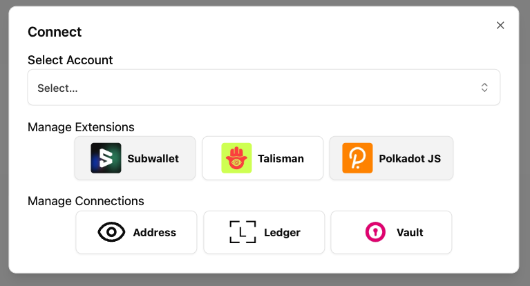

# PolkaHub

PolkaHub is a library to easily connect with different kinds of Polkadot Wallets, from browser extensions, to polkadot vault, to ledger devices.



## Features

- Modular design, plugin-based.
- State decoupled from UI.
- Powered by Polkadot-API utilities, but decoupled from it.
- Integrate with popular polkadot wallets in minutes:
  - Polkadot browser extensions
  - Polkadot vault
  - Ledger devices
  - Read-only accounts
  - Wallet connect (UI in development)
  - Proxy accounts (UI in development)
  - Multisig accounts (UI in development)
- Choose your own setup, even choose with or without "select account"
- Context-based API to access accounts

## Usage

Install from npm:

```sh
pnpm i polkahub
```

### React UI Components

If you want to use the pre-made UI components, it's required for your project to have tailwind v4 with a shadcn/ui theme configured. With that in place:

1. Import polkahub tailwind styles in your main `index.css`:

```css
@import "tailwindcss";
@import "polkahub";
```

2. Import, create and configure the providers you want:

```ts
/// file: account-providers.ts
import {
  createLedgerProvider,
  createPjsWalletProvider,
  createPolkadotVaultProvider,
  createReadOnlyProvider,
  createSelectedAccountPlugin,
} from "polkahub";

// Example, these are all optional. Use the ones you need.
const selectedAccountPlugin = createSelectedAccountPlugin();
const pjsWalletProvider = createPjsWalletProvider();
const polkadotVaultProvider = createPolkadotVaultProvider();
const readOnlyProvider = createReadOnlyProvider();

export const accountProviders = [
  selectedAccountPlugin,
  pjsWalletProvider,
  polkadotVaultProvider,
  readOnlyProvider,
];
```

3. Wrap your application with the context:

```tsx
import { PolkaHubProvider } from "polkahub";
import { StrictMode } from "react";
import App from "./App.tsx";
import { accountProviders } from "./account-providers";

createRoot(document.getElementById("root")!).render(
  <StrictMode>
    <PolkaHubProvider
      plugins={accountProviders}
      getBalance={async (address: SS58String) => {
        // Some plugins show the balance of an account for reference.
        // Use your favorite provider, or ignore / return null to disable
        return null;
      }}
      getIdentity={async (address: SS58String) => {
        // Some plugins show the identity of an account for reference.
        // Use your favorite provider, or ignore / return null to disable
        return null;
      }}
    >
      <App />
    </PolkaHubProvider>
  </StrictMode>
);
```

4. Add the modal button where you want to, passing in the UI components to manage the state:

```tsx
import {
  // Button that opens an empty dialog
  PolkaHubModal,
  // Component to add an account selection
  SelectAccountField,
  // Component to manage PJS-like browser wallets
  ManagePjsWallets,
  // Button to manage polkadot vault accounts
  ManageVault,
  // Button to manage user-defined accounts
  ManageReadOnly,
} from "polkahub";

export const ConnectButton = () => (
  <PolkaHubModal>
    <SelectAccountField />
    <ManagePjsWallets />
    <ConnectSource />
    <div>
      <h3>Manage Connections</h3>
      <div className="flex gap-2 flex-wrap items-center justify-center">
        <ManageVault />
        <ManageReadOnly />
      </div>
    </div>
  </PolkaHubModal>
);
```

5. Consume accounts

```tsx
// Anywhere within PolkadotHubContext
import { useSelectedAccount, useAvailableAccounts } from "polkahub";

const MyComponent = () => {
  // Record groupName => Account[]
  const availableAccounts = useAvailableAccounts();

  // `Account` is an object with the account info, and an optional property "signer"
  // that can be used to sign any transaction
  // (it's optional for the read-only accounts)

  // If selectedAccountPlugin is added, you can quickly grab/set the selected account
  const [account, setAccount] = useSelectedAccount();

  return <div>…</div>;
};
```

### Other React UIs

The modular architecture of PolkaHub makes it possible to build your own UI instead of using the bundled one.

1. Follow the steps setting up the plugins and the global context mentioned above.

2. Use the available hooks to access the data with each plugin to integrate with it

```tsx
import { usePlugin } from "polkahub";
const MyCustomPjsWalletManager = () => {
  const plugin = usePlugin<PolkadotVaultProvider>(polkadotVaultProviderId)!;

  // Or import the plugin you created on step 1

  return <div>…</div>;
};
```

3. Read below to consume the state.

### State-only (Advanced)

Each plugin has a minimal structure, but can define additional properties both on the plugin itself and the Account object it works with:

```ts
interface Account {
  provider: string;
  address: SS58String;
  signer?: PolkadotSigner;
  name?: string;
}

interface SerializableAccount<T = unknown> {
  provider: string;
  address: SS58String;
  name?: string;
  extra?: T;
}

interface Plugin<A extends Account = Account> {
  id: string;

  // Methods needed by other plugins (like select account) to persist accounts from other plugins
  // Defaults to grabbing the serializable values from the base "Account"
  serialize?: (account: A) => SerializableAccount;
  deserialize: (value: SerializableAccount) => Promise<A | null> | A | null;

  // Method needed to check when an account was removed
  // Defaults to address equality
  eq?: (a: A, b: A) => boolean;

  accounts$: Observable<A[]>;
  // Defaults to Record<id, accounts$>
  accountGroups$?: Observable<Record<string, A[]>>;

  // Hooks
  // Used by plugins which might need to query other plugins (select account, multisig, proxy, etc.)
  receivePlugins?: (plugins: Plugin[]) => void;
  // Control observable to start subscriptions and add a teardown mechanism.
  subscription$?: Observable<unknown>;
}
```

If you're consuming the state without using the React `PolkaHubProvider`, then all you need to do to make the pre-made plugins work is just wire them up.

Because `PolkaHubProvider` is a react component and technically you can have multiple instances, polkahub supports multiple instances. This means that every global observable exported from 'polkahub' needs an instanceId. You can hard-code it if you have control of that:

```ts
import { merge, EMPTY } from "rxjs";
import type { Plugin, setPlugins, addInstance } from "polkahub";

const instanceId = "my-app";
const setupPlugins = (plugins: Plugin<any>) => {
  // initialize the subscription$ for those plugins that need it.
  const sub = merge(plugins.map((p) => p.subscription$ ?? EMPTY)).subscribe();

  addInstance(instanceId);
  setPlugins(instanceId, plugins);

  return sub;
};
```

Every pre-bundled plugin exposes its own state through observables, as that allows for reactivity. Specific plugin docs are WIP, browse the plugin source code to understand their state.
